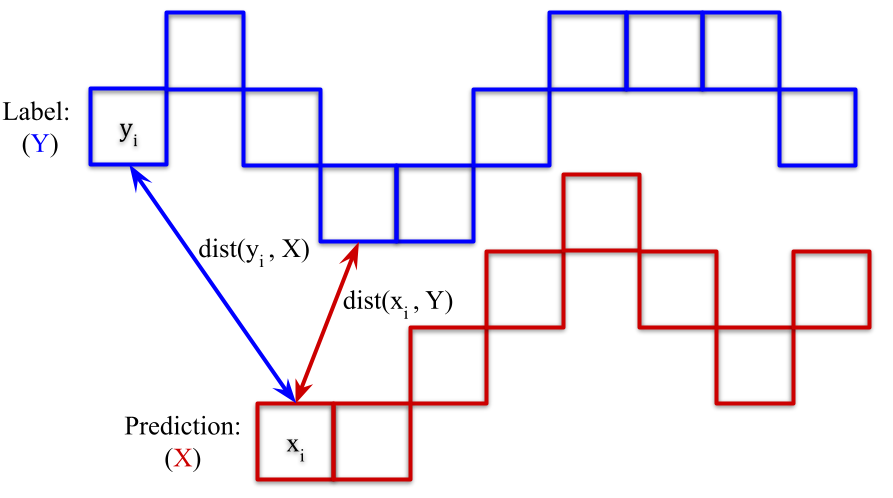

# Multi-Task Learning for Glacier Segmentation and Calving Front Prediction with the nnU-Net.

This project contains the pytheon code fot the experiments in the Master's thesis of Oskar Herrmann.
The project was build up on th ennU/Net project by Isensee, F., Jaeger, P. F. (2020). The folder that are new to the
project are marked as xx_new.py. I tried to change a minimum number of original files and create new ones,
but it was no always feasible.

## Out-of-the-box claving front detection

1. Download this repository extract the files.
2. Download the pretrained model from Zenodo and extract the zip-file https://zenodo.org/record/7837300#.ZD1OI9IzbUA.
2. Install the repository 
   3. Create a new virtual environment with `python3 -m venv /path/to/venv/nnunet` and repace the path with the location,
             where the virtual environment should be installed.
   4. Activate the environment with `source  /path/to/venv/nnunet/bin/activate`.
   5. Install the repository by entering `pip install -e /path/to/extraced/repository/nnunet_clavingfront` and replace the path.
3. Run the calving front prediction with `bash RUN_CALBINGFRONT_DETECTION.sh /path/to/SARimages/ /path/to/pretrained/model` and replace the paths
with the path to the folder containing the SAR images and path to the pretrained model.

## 1. Dataset

The dataset is provided by Gourmelon et al. and can be found [here](https://doi.pangaea.de/10.1594/PANGAEA.940950).
It contains 681 SAR images of seven glaciers taken by seven different satellites. Two glaciers are located in the
northern hemisphere and five in the southern hemisphere. The two glaciers on the southern hemisphere are the Columbia
Glacier in Alaska and the Jacobshavn in Greenland. Both glaciers are
famous representatives of their regions because they are two of the largest tidewater glaciers in the world. The
Columbia Glacier has a length of 51 km, and a thickness of 550 m. The glacier has been retreating at a rate of
approximately 0.6 km per year since 1982. Jacobshaven has a length of 65 km, a thickness of
2000 m, and retreated 27.4 km between 1902 and 2010. The five glaciers in the southern
hemisphere are all located at the Arctic Penisula.


Properties of the dataset including list of captured glaciers train-test-split,
number of images per glacier, and covered area in km.

The dataset contains two labels for each glacier image. One is a mask of the different
zones of the glacier (ocean, glacier, radar shadow, rock). The other label contains a 1 pixel
wide line representing the calving front. A sample of each glacier in the training set with
its corresponding labels is shown in Figure 2. Predicting the zone mask can be seen as a
classic segmentation problem. The only specialty is that all pixels are associated with a
specific class so that there is no general ’background’-class for unclassifiable pixels. Because
of the high-class imbalance, the calving front delineation is a more difficult task. Fewer
than 1 % of the pixels are labeled as the front. Additionally, the structure of the class
region is not a convex hull but a thin line.

Figure 2: Sample images of every glacier in the train set and their corresponding labels.
The first row shows the front label with black background and a 1 pixel wide white line
representing the calving front. The second row contains the zone labels with four classes:
ocean (white), glacier (light gray), rock (dark gray), radar shadow (black).

Every glacier is captured by multiple satellites for a higher temporal resolution. Mean-
ing, that recordings of one glacier are captured by different SAR systems with different
resolutions. In Figure 3 a timeline of the images of each glacier visualizes the observation
time and frequency of the images. The first two rows show the glacier of the test set.

Figure 3: Distribution of the dataset’s images over time. The samples are grouped by the
seven glaciers, and colored according to the capturing satellite.

## 2. nnU-Net 
The nnU-Net by Fabian Isensee et al. [Ise+21] reduces the hyperparameter
search by taking a fingerprint of the dataset and adjusting hyperparameters accordingly.
Additionally, there are fixed parameters. These parameters are based on the authors’
experience and generalize well across a variety of tasks. The structure of the nnU-Net is
visualized in Figure 4.

Figure 4: Illustration of the nnU-Net framework created by Isensee et al. [Ise+21]

I retraced the pipline of the nnU-Net and created the following visualizations. Figure 5 show the whole pipeline
including the added python scripts. The data samples and the labels have to be in the Neuroimaging Informatics Technology
Initiative (NIfTI) file format, separated into test and training samples. The NIfTI file format
was developed for neuroimaging. The files store 3D scans of brains or other organs. The
format stores additional information about the orientation of the data, distances between
the individual pixels/voxels, and layers. Because the nnU-Net was developed for medical
imaging, it uses this file format.

Figure 5: Scripts for conversion between PNG and NIfTI (blue), nnU-Net scripts (purple),
evaluation scripts (green).

### 2.1 Preprocessing

The nnU-Net crops borders before the
dataset fingerprint is created. While the dataset is perused for black borders, properties of
every image, including size and spacing, are stored. After the cropping, every sample and
its corresponding label is stacked into one NIfTI file. Finally, the dataset’s fingerprint is
created by analyzing the dataset. The fingerprint includes the size and spacing of every
sample, the number of classes, the imaging modality, and the intensity distribution.
Based on the dataset’s fingerprint and the available Random Access Memory (RAM)
of the Graphics Processing Unit (GPU), a plan for the training and architecture of the
U-Net is created. The hyperparameters concerning the architecture is the patch size and
the number of layers. Most often, using the whole data sample as the input for the U-Net
results in a massive number of parameters and will not fit on traditional GPUs. Therefore,
the image is divided into smaller parts called patches. Their segmentation mask is stitched
together afterwards to get a segmentation of the whole image. The patch size is initialized
with the median image shape and iteratively reduced until at least two images can be
processed in parallel. The number of images passed through the network in parallel is called
batch size and provides a more stable training. Here a larger patch size is preferred over a
larger batch size to provide more contextual information for the segmentation. The patch
size also represents the size of the first and last layer of the U-Net.

Figure 6: Plan and preprocessing pipeline including generated files. The python scripts
are reduced to the important functions.

### 2.2. Training
Before the training starts, the network trainer and the network have to be initialized with
the parameters generated by the previous step. The trainer’s parameters are learning rate,
loss function, the maximum number of epochs, optimizer, and dataloader. The dataloader
is responsible for creating the patches, batches, and augmentation of the samples. There
are 11 augmentation steps in the nnU-Net listed in the Table below.


In the next step, the network is created based on the generated parameters. The U-Net
consists of multiple blocks (in this work: nine encoder blocks and eight decoder blocks).
The encoder block and the decoder block are illustrated in Figure 7. The encoder block
contains two convolutional layers. Each block is followed by an instance normalization and
the activation function (leaky rectified linear unit). For instance normalization, the mean
and variance are calculated for every feature map. Afterwards, it is subtracted by the mean
and divided by the variance. The decoder block takes as input the output of the previous
block and the output of the corresponding encoder block. The output of the previous block
is scaled up with a transpose convolution and then concatenated with the encoder output.
Then the decoder block is equally structured with the encoder block. The output is used
by the next layer and the deep supervision part.

Figure 7: Illustration of the encoder and decoder blocks that make up the architecture of
the nnU-Net. The encoder and the decoder contain multiple blocks.

After everything is initialized, the network is trained to minimize the loss function.
The loss function of the nnU-Net is the summation of the cross entropy loss. Typically one epoch
corresponds to feeding every dataset sample to the network. The nnU-Net sets a fixed
number of iterations (250) to be one epoch. Because the network ensures that at least
one-third of samples contain a randomly chosen foreground class, this is especially helpful
for the class imbalance of the front label, where most of the patches do not contain any
class. 


### 2.3 Post-processing
The trained model can be used to detect the target in unseen data. First, the model files
are loaded from the specified fold. Afterwards, the network preprocesses the hold-out test
set. The test samples are divided into patches similar to the training samples. For a robust
result, the patches are rotated three times, and the three resulting predictions are then
combined by averaging the pixel values. The network accuracy decreased towards the
borders of patches, therefore the predictions are weighted by a Gaussian bell. Finally, the
patches overlap by half of the patch size to get a smoother final result and stored as NIfTI
files in the specified folder. The inference script and its steps are illustrated in Figure 3.11.


## 3. Adjustments of the nnU-Net Pipeline
There are mainly two approaches that can
be distinguished. The approach that requires a minimum change to the vanilla U-Net is
created by adding the second label as a second channel to the last layer (late-branching).
Only the parameters for an additional kernel in the last layer need to be trained additionally.
The total number of parameters that need to be trained changes insignificantly. The second
approach uses one decoder for every label (early-branching).


The PNGs of glaciers had to be converted to the NIfTI file format. Because the glacier
labels are 2D, the two labels were stacked in one label file with the label of the front located
at z = 0 and the zone masks at z = 1. In the dataset.json, which contains the dataset’s
metadata, the label entry contains a list of multiple labels with multiple classes instead of a
single list of classes. After the dataset is in the desired directory and format, the nnU-Net
scripts can be executed.
Changes in the preprocessing concern mainly the added dimension of the labels in
dataset.json. Meaning, there are now multiple labels, each with multiple classes. And
not one label with multiple classes. During the planning of the experiment, the es-
timated size of the network architecture is requested. This work implements a new
class Generic_UNet_MTLearly, which returns the network’s size in a method (com-
pute_approx_vram_consumption). For comparison, this value is also used for the late-
branching network, even if its size is small. Otherwise, early and late branching networks
would be trained on different patch sizes. Generic_UNet_MTLearly is derived from the
given class Generic_UNet, which was included in the framework and is used in this work
for the single task segmentation. The Generic_UNet_MTLearly contains a second decoder, which is created in the initialization of every instance of the class and used in the
forward-function. The outputs of both decoders is concatenated before returned.
Another class is responsible for the training of the network. The given nnUNetTrainerV2
was used for the single task segmentation. For the MTL a new nnUNetTrainerMTLearly
and nnUNetTrainerMTLlate were derived from the single task trainer. These trainer
classes contain hyperparameters, e.g., a maximum number of epochs and deep supervision
scales. They also trigger the initialization the network, run feedforward, compute the loss
and trigger the update of the weights. The initialization of the network is done in the
aforementioned Generic_UNet classes. For early-branching, the last layer and the layer
for deep supervision are modified to create two channel outputs. For lat e-branching, the
decoder is duplicated, and the results of the decoders are concatenated before the return of
the feedforward. After every iteration, the error of both labels is calculated as described in
Section 3.6.2 and summed up with an equal weighting (unitary scalarization).
Only minor changes had to be made in the inference script (predict_simple.py). After
the test samples are divided into patches and fed through the network, multiple channels
of the network’s output had to be separated and the patch predictions are composed to
the prediction of the whole image. A list of the edited and added scripts is provided in the following table.


## 4. Experiments
The first research goal is to apply the out-of-the-box nnU-Net, how it is intended to
be used, on the glacier front detection and on the glacier zone segmentation, which is
represented by the first two columns in the Figure 5.1. 5-fold cross-validation is used to
eliminate the bias of the weight initialization, and the bias of the data split into training
and validation sets. Every column in Figure 5.1 represents five newly trained U-Nets,
with common hyperparameters but different weight initialization. The evaluations of the
individual models are averaged to get a robust measure independent of weight initialization
and data split.

raining the nnU-Net directly on the front labels is the most straightforward approach to
get a method for calving front detection. The label of the calving front is dilated to the width
of five pixels. In provisional experiments the dilation has shown to make the predictions
more robust. For the training with zone labels, the evaluation script includes extraction of
the boundary between ocean and glacier, which is described in more detail in Section 5.2.
The following approach is to train the U-Net on the zone and front label simultaneously.
Two architectures are compared. The early-branching and the late-branching network are
described in Section 4.1. The fifth experiment of this work extracts the boundaries of the
glacier zone to all other zones as a third segmentation task for the U-Net (see Figure 5.2).
In contrast to the calving front segmentation, which is a particular part of the boundary
between glacier and ocean. The label of the glacier boundaries was extracted from the zone
label. All glacier pixels with a neighbouring rock or shadow pixel are assigned as glacier
boundary. The hypothesis is that providing more information about the same domain
benefits the performance of the U-Net on the individual task. The last experiment fuses
the two labels by creating a fourth class in the zone label associated with the glacier front.
Because the front line has a width of five pixels, the other zone classes are merely impaired.

After the samples are converted and stored in the correct directory, the first nnU-Net
script reprocesses the data, takes a fingerprint of the dataset, and generates a corresponding
plan for the training. The training plan contains the number of layers, kernel size for every
convolutional layer, patch, and batch size. For the glacier dataset and a NVIDIA RTX 3080
with 12GB memory, the resulting network architecture has nine encoder blocks and eight
decoder blocks (see Figure 3.8). Considering that every block has two convolutional layers,
the network architecture is relatively deep compared to the U-net presented in [Ron+15].
Deep networks usually suffer from vanishing gradients. Vanishing gradients is avoided
in this U-Net with 34 convolutional layers using deep supervisions. Deep supervision is
explained in more detail in Section 3.6.2. The kernels of all convolutional layers have the
size of 3x3. During training, one batch contains two images. Each image has a patch size
of 1024 x 896 pixels. The second nnU-Net script trains the network and stores the trained
models. The U-Net is trained with an SGD optimizer with an initial learning rate of 0.01,
a Nesterov momentum of 0.99, and a weight decay of 3e-5. Training of one epoch took
between 100 s and 160 s. The nnU-Net uses early-stopping, but due to limited resources
the maximum number of epochs (500) is reached in every training. The common way to
define one epoch to iterate over every sample of the training set. The nnU-Net uses a fixed
number of iterations (250) to define one epoch. In iteration the batch is sampled depending
on the class distribution of the sample to counteract class-imbalance. After the training,
the final model is used to predict the test set. The predictions of the test set are stored in
NIfTI files. After the test predictions are converted back to PNG, the results are evaluated.

The first nnU-Net script reprocesses the data, takes a fingerprint of the dataset, and generates a corresponding
plan for the training. The training plan contains the number of layers, kernel size for every
convolutional layer, patch, and batch size. For the glacier dataset and a NVIDIA RTX 3080
with 12GB memory, the resulting network architecture has nine encoder blocks and eight
decoder blocks. Considering that every block has two convolutional layers,
the network architecture is relatively deep compared to the U-net presented in [Ron+15].
Deep networks usually suffer from vanishing gradients. Vanishing gradients is avoided
in this U-Net with 34 convolutional layers using deep supervisions. Deep supervision is
explained in more detail in Section 3.6.2. The kernels of all convolutional layers have the
size of 3x3. During training, one batch contains two images. Each image has a patch size
of 1024 x 896 pixels. The second nnU-Net script trains the network and stores the trained
models. The U-Net is trained with an SGD optimizer with an initial learning rate of 0.01,
a Nesterov momentum of 0.99, and a weight decay of 3e-5. Training of one epoch took
between 100 s and 160 s. The nnU-Net uses early-stopping, but due to limited resources
the maximum number of epochs (500) is reached in every training. The common way to
define one epoch to iterate over every sample of the training set. The nnU-Net uses a fixed
number of iterations (250) to define one epoch. In iteration the batch is sampled depending
on the class distribution of the sample to counteract class-imbalance. After the training,
the final model is used to predict the test set. The predictions of the test set are stored in
NIfTI files. After the test predictions are converted back to PNG, the results are evaluated.
A visualization of the training progress of third experiment with a late-branching
architecture is shown in the gif below The gif shows a random sample of the training set.
The predictions of the nnU-Net after different numbers of epochs are superimposed on the
input image. In epoch 0 The classes
are randomly assigned to the pixels. This leads to a noisy pattern of where all classes are
equally distributed.The third and last nnU-Net script executes the inference. After a few epochs
the class distributions of the prediction
is already close to the target distribution. A small number pixels is classified as the glacier
front and large number of pixels classified as the glacier. The ocean classifications are large
clusters but some of them are falsely located in the glacier zone. In the end the calving front 
and the ocean is classified correctly
only some parts of the glacier are classified as rock and vice versa. Visually, the predictions
are similar to the target

 

The evaluation metric measures how accurate, precise, and robust the method detects the
position of the calving front. Additionally, the precision of the glacier zone segmentation is
meaningful information. The mean distance between the front pixels of the label and the
front pixels of the prediction is used to evaluate the calving front detection. For every pixel
in the label front Y , the distance to the closest pixel in the predicted front X is determined.
Additionally, the distance to its closest pixel in the predicted front is determined for every
pixel in the label front. Both distances are averaged and taken as the mean distance between
the two lines.
 
## 5. Results
The evaluation metrics described above, show that both tasks achieve higher
accuracy with MTL compared to Single-Task Learning (STL). In Figure 6.1 the front
delineation error of every experiment is compared. The STL approach that is trained on
front label has a front delineation error of 1103 ± 72 m and the STL approach that is trained
on the zone label has a front delineation error of 1184 ± 225 m. The difference between the
STL experiments is that the variance of the performance of the trained model is higher
when trained on the zone labels.


The distribution of the test set prediction is plotted in Figure 6.4. In the first row, all
122 test samples are drawn as dots. The median is the middle line in the orange rectangle,
and the dashed line represents the mean. The x-axis has a logarithmic scale. Otherwise, the
outliers would dominate the plot. The rectangle reaches from the first quartile to the third
quartile. Each quartile contains 25 % of the data points. The rows below represent the
samples captured during different seasons. The test set contains two glaciers: Mapple and
COL. The glaciers are located on different hemispheres, therefore the winter and summer
months are different for each glacier. Winter in the northern hemisphere is from October
to March, and winter in the southern hemisphere is from April to August. The mean of the
front prediction of the samples captured during summer have higher precision 458 ± 1060 m
than the samples captured during the winter months 996 ± 1683 m. However, the medians
are more similar with 133 m in the summer month and 185 m in the winter month.


In this Figure the distribution of the prediction is divided into the two glaciers. The
front delineation error for the calving front of Mapple is, on average 127 ± 107 m while
the mean error of COL is 1184 ± 1761 m. This is caused by a group of predictions with an
error > 2000 m. The median value is 275 m for COL and 97 m for Mapple.


In this Figure  the front delineation error is grouped by satellite. The predictions of
samples created by ERS, ENVISAT, PALSAR, and TDX have an similar average error
between 150 m and 300 m. The prediction of samples created by TSX are more precise
with 68 ± 59 m and the error on samples created by S1 are less precise with 2060 ± 2139 m.
Most test samples are captured by TSX, TDX and S1. TSX and TDX have a resolution of
6 − 7 m, while S1 has a resolution of 20 m.


Calving front prediction of COL on 3.9.2011, 22.6.2014, and 11.2.2016 taken by
TDX with 7 m2/pixel resolution; label (blue), prediction (yellow), overlap (magenta).


(a) Glacier images taken by ERS (20 m2/pixel)
on 5.2.2007, 20.3.2010, and 8.9.2017.
(b) Glacier images taken by TSX (7 m2/pixel)
on 4.11.2008, 2.11.2009, and 2.8.2013.
Figure 6.9: Calving front prediction of Mapple Glacier; label (blue), prediction (yellow),
overlap (magenta), bounding box (cyan). 

All plots are generated by the files in the directory create_plots_new or by hand.

# vvv Readme of the original git project vvv

**[2020_10_21] Update:** We now have documentation for [common questions](documentation/common_questions.md) and
[common issues](documentation/common_problems_and_solutions.md). We now also provide [reference epoch times for
several datasets and tips on how to identify bottlenecks](documentation/expected_epoch_times.md).

Please read these documents before opening a new issue!

# nnU-Net

In 3D biomedical image segmentation, dataset properties like imaging modality, image sizes, voxel spacings, class
ratios etc vary drastically.
For example, images in
the [Liver and Liver Tumor Segmentation Challenge dataset](https://competitions.codalab.org/competitions/17094)
are computed tomography (CT) scans, about 512x512x512 voxels large, have isotropic voxel spacings and their
intensity values are quantitative (Hounsfield Units).
The [Automated Cardiac Diagnosis Challenge dataset](https://acdc.creatis.insa-lyon.fr/) on the other hand shows cardiac
structures in cine MRI with a typical image shape of 10x320x320 voxels, highly anisotropic voxel spacings and
qualitative intensity values. In addition, the ACDC dataset suffers from slice misalignments and a heterogeneity of
out-of-plane spacings which can cause severe interpolation artifacts if not handled properly.

In current research practice, segmentation pipelines are designed manually and with one specific dataset in mind.
Hereby, many pipeline settings depend directly or indirectly on the properties of the dataset
and display a complex co-dependence: image size, for example, affects the patch size, which in
turn affects the required receptive field of the network, a factor that itself influences several other
hyperparameters in the pipeline. As a result, pipelines that were developed on one (type of) dataset are inherently
incomaptible with other datasets in the domain.

**nnU-Net is the first segmentation method that is designed to deal with the dataset diversity found in the domain. It
condenses and automates the keys decisions for designing a successful segmentation pipeline for any given dataset.**

nnU-Net makes the following contributions to the field:

1. **Standardized baseline:** nnU-Net is the first standardized deep learning benchmark in biomedical segmentation.
   Without manual effort, researchers can compare their algorithms against nnU-Net on an arbitrary number of datasets
   to provide meaningful evidence for proposed improvements.
2. **Out-of-the-box segmentation method:** nnU-Net is the first plug-and-play tool for state-of-the-art biomedical
   segmentation. Inexperienced users can use nnU-Net out of the box for their custom 3D segmentation problem without
   need for manual intervention.
3. **Framework:** nnU-Net is a framework for fast and effective development of segmentation methods. Due to its modular
   structure, new architectures and methods can easily be integrated into nnU-Net. Researchers can then benefit from its
   generic nature to roll out and evaluate their modifications on an arbitrary number of datasets in a
   standardized environment.

For more information about nnU-Net, please read the following paper:

    Isensee, F., Jaeger, P. F., Kohl, S. A., Petersen, J., & Maier-Hein, K. H. (2020). nnU-Net: a self-configuring method 
    for deep learning-based biomedical image segmentation. Nature Methods, 1-9.

Please also cite this paper if you are using nnU-Net for your research!

# Table of Contents

- [Installation](#installation)
- [Usage](#usage)
    * [How to run nnU-Net on a new dataset](#how-to-run-nnu-net-on-a-new-dataset)
        + [Dataset conversion](#dataset-conversion)
        + [Experiment planning and preprocessing](#experiment-planning-and-preprocessing)
        + [Model training](#model-training)
            - [2D U-Net](#2d-u-net)
            - [3D full resolution U-Net](#3d-full-resolution-u-net)
            - [3D U-Net cascade](#3d-u-net-cascade)
                * [3D low resolution U-Net](#3d-low-resolution-u-net)
                * [3D full resolution U-Net](#3d-full-resolution-u-net-1)
            - [Multi GPU training](#multi-gpu-training)
        + [Identifying the best U-Net configuration](#identifying-the-best-u-net-configuration)
        + [Run inference](#run-inference)
    * [How to run inference with pretrained models](#how-to-run-inference-with-pretrained-models)
    * [Examples](#examples)
- [Extending/Changing nnU-Net](#extending-or-changing-nnu-net)
- [Information on run time and potential performance bottlenecks.](#information-on-run-time-and-potential-performance-bottlenecks)
- [Common questions and issues](#common-questions-and-issues)

# Installation

nnU-Net has been tested on Linux (Ubuntu 16, 18 and 20; centOS, RHEL). We do not provide support for other operating
systems.

nnU-Net requires a GPU! For inference, the GPU should have 4 GB of VRAM. For training nnU-Net models the GPU should have
at
least 10 GB (popular non-datacenter options are the RTX 2080ti, RTX 3080 or RTX 3090). Due to the use of automated mixed
precision, fastest training times are achieved with the Volta architecture (Titan V, V100 GPUs) when installing pytorch
the easy way. Since pytorch comes with cuDNN 7.6.5 and tensor core acceleration on Turing GPUs is not supported for 3D
convolutions in this version, you will not get the best training speeds on Turing GPUs. You can remedy that by compiling
pytorch from source
(see [here](https://github.com/pytorch/pytorch#from-source)) using cuDNN 8.0.2 or newer. This will unlock Turing GPUs
(RTX 2080ti, RTX 6000) for automated mixed precision training with 3D convolutions and make the training blistering
fast as well. Note that future versions of pytorch may include cuDNN 8.0.2 or newer by default and
compiling from source will not be necessary.
We don't know the speed of Ampere GPUs with vanilla vs self-compiled pytorch yet - this section will be updated as
soon as we know.

For training, we recommend a strong CPU to go along with the GPU. At least 6 CPU cores (12 threads) are recommended. CPU
requirements are mostly related to data augmentation and scale with the number of input channels. They are thus higher
for datasets like BraTS which use 4 image modalities and lower for datasets like LiTS which only uses CT images.

We very strongly recommend you install nnU-Net in a virtual environment.
[Here is a quick how-to for Ubuntu.](https://linoxide.com/linux-how-to/setup-python-virtual-environment-ubuntu/)
If you choose to compile pytorch from source, you will need to use conda instead of pip. In that case, please set the
environment variable OMP_NUM_THREADS=1 (preferably in your bashrc using `export OMP_NUM_THREADS=1`). This is important!

Python 2 is deprecated and not supported. Please make sure you are using Python 3.

1) Install [PyTorch](https://pytorch.org/get-started/locally/). You need at least version 1.6
2) Install nnU-Net depending on your use case:
    1) For use as **standardized baseline**, **out-of-the-box segmentation algorithm** or for running **inference with
       pretrained models**:

       ```pip install nnunet```

    2) For use as integrative **framework** (this will create a copy of the nnU-Net code on your computer so that you
       can modify it as needed):
          ```bash
          git clone https://github.com/MIC-DKFZ/nnUNet.git
          cd nnUNet
          pip install -e .
          ```
3) nnU-Net needs to know where you intend to save raw data, preprocessed data and trained models. For this you need to
   set a few of environment variables. Please follow the instructions [here](documentation/setting_up_paths.md).
4) (OPTIONAL) Install [hiddenlayer](https://github.com/waleedka/hiddenlayer). hiddenlayer enables nnU-net to generate
   plots of the network topologies it generates (see [Model training](#model-training)). To install hiddenlayer,
   run the following commands:
    ```bash
    pip install --upgrade git+https://github.com/FabianIsensee/hiddenlayer.git@more_plotted_details#egg=hiddenlayer
    ```

Installing nnU-Net will add several new commands to your terminal. These commands are used to run the entire nnU-Net
pipeline. You can execute them from any location on your system. All nnU-Net commands have the prefix `nnUNet_` for
easy identification.

Note that these commands simply execute python scripts. If you installed nnU-Net in a virtual environment, this
environment must be activated when executing the commands.

All nnU-Net commands have a `-h` option which gives information on how to use them.

A typical installation of nnU-Net can be completed in less than 5 minutes. If pytorch needs to be compiled from source
(which is what we currently recommend when using Turing GPUs), this can extend to more than an hour.

# Usage

To familiarize yourself with nnU-Net we recommend you have a look at the [Examples](#Examples) before you start with
your own dataset.

## How to run nnU-Net on a new dataset

Given some dataset, nnU-Net fully automatically configures an entire segmentation pipeline that matches its properties.
nnU-Net covers the entire pipeline, from preprocessing to model configuration, model training, postprocessing
all the way to ensembling. After running nnU-Net, the trained model(s) can be applied to the test cases for inference.

### Dataset conversion

nnU-Net expects datasets in a structured format. This format closely (but not entirely) follows the data structure of
the [Medical Segmentation Decthlon](http://medicaldecathlon.com/). Please read
[this](documentation/dataset_conversion.md) for information on how to convert datasets to be compatible with nnU-Net.

### Experiment planning and preprocessing

As a first step, nnU-Net extracts a dataset fingerprint (a set of dataset-specific properties such as
image sizes, voxel spacings, intensity information etc). This information is used to create three U-Net configurations:
a 2D U-Net, a 3D U-Net that operated on full resolution images as well as a 3D U-Net cascade where the first U-Net
creates a coarse segmentation map in downsampled images which is then refined by the second U-Net.

Provided that the requested raw dataset is located in the correct
folder (`nnUNet_raw_data_base/nnUNet_raw_data/TaskXXX_MYTASK`,
also see [here](documentation/dataset_conversion.md)), you can run this step with the following command:

```bash
nnUNet_plan_and_preprocess -t XXX --verify_dataset_integrity
```

`XXX` is the integer identifier associated with your Task name `TaskXXX_MYTASK`. You can pass several task IDs at once.

Running `nnUNet_plan_and_preprocess` will populate your folder with preprocessed data. You will find the output in
nnUNet_preprocessed/TaskXXX_MYTASK. `nnUNet_plan_and_preprocess` creates subfolders with preprocessed data for the 2D
U-Net as well as all applicable 3D U-Nets. It will also create 'plans' files (with the ending.pkl) for the 2D and
3D configurations. These files contain the generated segmentation pipeline configuration and will be read by the
nnUNetTrainer (see below). Note that the preprocessed data folder only contains the training cases.
The test images are not preprocessed (they are not looked at at all!). Their preprocessing happens on the fly during
inference.

`--verify_dataset_integrity` should be run at least for the first time the command is run on a given dataset. This will
execute some
checks on the dataset to ensure that it is compatible with nnU-Net. If this check has passed once, it can be
omitted in future runs. If you adhere to the dataset conversion guide (see above) then this should pass without issues :
-)

Note that `nnUNet_plan_and_preprocess` accepts several additional input arguments. Running `-h` will list all of them
along with a description. If you run out of RAM during preprocessing, you may want to adapt the number of processes
used with the `-tl` and `-tf` options.

After `nnUNet_plan_and_preprocess` is completed, the U-Net configurations have been created and a preprocessed copy
of the data will be located at nnUNet_preprocessed/TaskXXX_MYTASK.

Extraction of the dataset fingerprint can take from a couple of seconds to several minutes depending on the properties
of the segmentation task. Pipeline configuration given the extracted finger print is nearly instantaneous (couple
of seconds). Preprocessing depends on image size and how powerful the CPU is. It can take between seconds and several
tens of minutes.

### Model training

nnU-Net trains all U-Net configurations in a 5-fold cross-validation. This enables nnU-Net to determine the
postprocessing and ensembling (see next step) on the training dataset. Per default, all U-Net configurations need to
be run on a given dataset. There are, however situations in which only some configurations (and maybe even without
running the cross-validation) are desired. See [FAQ](documentation/common_questions.md) for more information.

Note that not all U-Net configurations are created for all datasets. In datasets with small image sizes, the U-Net
cascade is omitted because the patch size of the full resolution U-Net already covers a large part of the input images.

Training models is done with the `nnUNet_train` command. The general structure of the command is:

```bash
nnUNet_train CONFIGURATION TRAINER_CLASS_NAME TASK_NAME_OR_ID FOLD  --npz (additional options)
```

CONFIGURATION is a string that identifies the requested U-Net configuration. TRAINER_CLASS_NAME is the name of the
model trainer. If you implement custom trainers (nnU-Net as a framework) you can specify your custom trainer here.
TASK_NAME_OR_ID specifies what dataset should be trained on and FOLD specifies which fold of the 5-fold-cross-validaton
is trained.

nnU-Net stores a checkpoint every 50 epochs. If you need to continue a previous training, just add a `-c` to the
training command.

IMPORTANT: `--npz` makes the models save the softmax outputs during the final validation. It should only be used for
trainings
where you plan to run `nnUNet_find_best_configuration` afterwards
(this is nnU-Nets automated selection of the best performing (ensemble of) configuration(s), see below). If you are
developing new
trainer classes you may not need the softmax predictions and should therefore omit the `--npz` flag. Exported softmax
predictions are very large and therefore can take up a lot of disk space.
If you ran initially without the `--npz` flag but now require the softmax predictions, simply run

```bash
nnUNet_train CONFIGURATION TRAINER_CLASS_NAME TASK_NAME_OR_ID FOLD -val --npz
```

to generate them. This will only rerun the validation, not the training.

See `nnUNet_train -h` for additional options.

#### 2D U-Net

For FOLD in [0, 1, 2, 3, 4], run:

```bash
nnUNet_train 2d nnUNetTrainerV2 TaskXXX_MYTASK FOLD --npz
```

#### 3D full resolution U-Net

For FOLD in [0, 1, 2, 3, 4], run:

```bash
nnUNet_train 3d_fullres nnUNetTrainerV2 TaskXXX_MYTASK FOLD --npz
```

#### 3D U-Net cascade

##### 3D low resolution U-Net

For FOLD in [0, 1, 2, 3, 4], run:

```bash
nnUNet_train 3d_lowres nnUNetTrainerV2 TaskXXX_MYTASK FOLD --npz
```

##### 3D full resolution U-Net

For FOLD in [0, 1, 2, 3, 4], run:

```bash
nnUNet_train 3d_cascade_fullres nnUNetTrainerV2CascadeFullRes TaskXXX_MYTASK FOLD --npz
```

Note that the 3D full resolution U-Net of the cascade requires the five folds of the low resolution U-Net to be
completed beforehand!

The trained models will we written to the RESULTS_FOLDER/nnUNet folder. Each training obtains an automatically generated
output folder name:

nnUNet_preprocessed/CONFIGURATION/TaskXXX_MYTASKNAME/TRAINER_CLASS_NAME__PLANS_FILE_NAME/FOLD

For Task002_Heart (from the MSD), for example, this looks like this:

    RESULTS_FOLDER/nnUNet/
    ├── 2d
    │   └── Task02_Heart
    │       └── nnUNetTrainerV2__nnUNetPlansv2.1
    │           ├── fold_0
    │           ├── fold_1
    │           ├── fold_2
    │           ├── fold_3
    │           └── fold_4
    ├── 3d_cascade_fullres
    ├── 3d_fullres
    │   └── Task02_Heart
    │       └── nnUNetTrainerV2__nnUNetPlansv2.1
    │           ├── fold_0
    │           │   ├── debug.json
    │           │   ├── model_best.model
    │           │   ├── model_best.model.pkl
    │           │   ├── model_final_checkpoint.model
    │           │   ├── model_final_checkpoint.model.pkl
    │           │   ├── network_architecture.pdf
    │           │   ├── progress.png
    │           │   └── validation_raw
    │           │       ├── la_007.nii.gz
    │           │       ├── la_007.pkl
    │           │       ├── la_016.nii.gz
    │           │       ├── la_016.pkl
    │           │       ├── la_021.nii.gz
    │           │       ├── la_021.pkl
    │           │       ├── la_024.nii.gz
    │           │       ├── la_024.pkl
    │           │       ├── summary.json
    │           │       └── validation_args.json
    │           ├── fold_1
    │           ├── fold_2
    │           ├── fold_3
    │           └── fold_4
    └── 3d_lowres

Note that 3d_lowres and 3d_cascade_fullres are not populated because this dataset did not trigger the cascade. In each
model training output folder (each of the fold_x folder, 10 in total here), the following files will be created (only
shown for one folder above for brevity):

- debug.json: Contains a summary of blueprint and inferred parameters used for training this model. Not easy to read,
  but very useful for debugging ;-)
- model_best.model / model_best.model.pkl: checkpoint files of the best model identified during training. Not used right
  now.
- model_final_checkpoint.model / model_final_checkpoint.model.pkl: checkpoint files of the final model (after training
  has ended). This is what is used for both validation and inference.
- network_architecture.pdf (only if hiddenlayer is installed!): a pdf document with a figure of the network architecture
  in it.
- progress.png: A plot of the training (blue) and validation (red) loss during training. Also shows an approximation of
  the evlauation metric (green). This approximation is the average Dice score of the foreground classes. It should,
  however, only to be taken with a grain of salt because it is computed on randomly drawn patches from the validation
  data at the end of each epoch, and the aggregation of TP, FP and FN for the Dice computation treats the patches as if
  they all originate from the same volume ('global Dice'; we do not compute a Dice for each validation case and then
  average over all cases but pretend that there is only one validation case from which we sample patches). The reason
  for
  this is that the 'global Dice' is easy to compute during training and is still quite useful to evaluate whether a
  model
  is training at all or not. A proper validation is run at the end of the training.
- validation_raw: in this folder are the predicted validation cases after the training has finished. The summary.json
  contains the validation metrics (a mean over all cases is provided at the end of the file).

During training it is often useful to watch the progress. We therefore recommend that you have a look at the generated
progress.png when running the first training. It will be updated after each epoch.

Training times largely depend on the GPU. The smallest GPU we recommend for training is the Nvidia RTX 2080ti. With
this GPU (and pytorch compiled with cuDNN 8.0.2), all network trainings take less than 2 days.

#### Multi GPU training

**Multi GPU training is experimental and NOT RECOMMENDED!**

nnU-Net supports two different multi-GPU implementation: DataParallel (DP) and Distributed Data Parallel (DDP)
(but currently only on one host!). DDP is faster than DP and should be preferred if possible. However, if you did not
install nnunet as a framework (meaning you used the `pip install nnunet` variant), DDP is not available. It requires a
different way of calling the correct python script (see below) which we cannot support from our terminal commands.

Distributed training currently only works for the basic trainers (2D, 3D full resolution and 3D low resolution) and not
for the second, high resolution U-Net of the cascade. The reason for this is that distributed training requires some
changes to the network and loss function, requiring a new nnUNet trainer class. This is, as of now, simply not
implemented for the cascade, but may be added in the future.

To run distributed training (DP), use the following command:

```bash
CUDA_VISIBLE_DEVICES=0,1,2... nnUNet_train_DP CONFIGURATION nnUNetTrainerV2_DP TASK_NAME_OR_ID FOLD -gpus GPUS --dbs
```

Note that nnUNetTrainerV2 was replaced with nnUNetTrainerV2_DP. Just like before, CONFIGURATION can be 2d, 3d_lowres or
3d_fullres. TASK_NAME_OR_ID refers to the task you would like to train and FOLD is the fold of the cross-validation.
GPUS (integer value) specifies the number of GPUs you wish to train on. To specify which GPUs you want to use, please
make use of the
CUDA_VISIBLE_DEVICES envorinment variable to specify the GPU ids (specify as many as you configure with -gpus GPUS).
--dbs, if set, will distribute the batch size across GPUs. So if nnUNet configures a batch size of 2 and you run on 2
GPUs
, each GPU will run with a batch size of 1. If you omit --dbs, each GPU will run with the full batch size (2 for each
GPU
in this example for a total of batch size 4).

To run the DDP training you must have nnU-Net installed as a framework. Your current working directory must be the
nnunet folder (the one that has the dataset_conversion, evaluation, experiment_planning, ... subfolders!). You can then
run
the DDP training with the following command:

```bash
CUDA_VISIBLE_DEVICES=0,1,2... python -m torch.distributed.launch --master_port=XXXX --nproc_per_node=Y run/run_training_DDP.py CONFIGURATION nnUNetTrainerV2_DDP TASK_NAME_OR_ID FOLD --dbs
```

XXXX must be an open port for process-process communication (something like 4321 will do on most systems). Y is the
number of GPUs you wish to use. Remember that we do not (yet) support distributed training across compute nodes. This
all happens on the same system. Again, you can use CUDA_VISIBLE_DEVICES=0,1,2 to control what GPUs are used.
If you run more than one DDP training on the same system (say you have 4 GPUs and you run two training with 2 GPUs each)
you need to specify a different --master_port for each training!

*IMPORTANT!*
Multi-GPU training results in models that cannot be used for inference easily (as said above, all of this is
experimental ;-) ).
After finishing the training of all folds, run `nnUNet_change_trainer_class` on the folder where the trained model is
(see `nnUNet_change_trainer_class -h` for instructions). After that you can run inference.

### Identifying the best U-Net configuration

Once all models are trained, use the following
command to automatically determine what U-Net configuration(s) to use for test set prediction:

```bash
nnUNet_find_best_configuration -m 2d 3d_fullres 3d_lowres 3d_cascade_fullres -t XXX --strict
```

(all 5 folds need to be completed for all specified configurations!)

On datasets for which the cascade was not configured, use `-m 2d 3d_fullres` instead. If you wish to only explore some
subset of the configurations, you can specify that with the `-m` command. We recommend setting the
`--strict` (crash if one of the requested configurations is
missing) flag. Additional options are available (use `-h` for help).

### Run inference

Remember that the data located in the input folder must adhere to the format specified
[here](documentation/data_format_inference.md).

`nnUNet_find_best_configuration` will print a string to the terminal with the inference commands you need to use.
The easiest way to run inference is to simply use these commands.

If you wish to manually specify the configuration(s) used for inference, use the following commands:

For each of the desired configurations, run:

```
nnUNet_predict -i INPUT_FOLDER -o OUTPUT_FOLDER -t TASK_NAME_OR_ID -m CONFIGURATION --save_npz
```

Only specify `--save_npz` if you intend to use ensembling. `--save_npz` will make the command save the softmax
probabilities alongside of the predicted segmentation masks requiring a lot of disk space.

Please select a separate `OUTPUT_FOLDER` for each configuration!

If you wish to run ensembling, you can ensemble the predictions from several configurations with the following command:

```bash
nnUNet_ensemble -f FOLDER1 FOLDER2 ... -o OUTPUT_FOLDER -pp POSTPROCESSING_FILE
```

You can specify an arbitrary number of folders, but remember that each folder needs to contain npz files that were
generated by `nnUNet_predict`. For ensembling you can also specify a file that tells the command how to postprocess.
These files are created when running `nnUNet_find_best_configuration` and are located in the respective trained model
directory (
RESULTS_FOLDER/nnUNet/CONFIGURATION/TaskXXX_MYTASK/TRAINER_CLASS_NAME__PLANS_FILE_IDENTIFIER/postprocessing.json or
RESULTS_FOLDER/nnUNet/ensembles/TaskXXX_MYTASK/ensemble_X__Y__Z--X__Y__Z/postprocessing.json). You can also choose to
not provide a file (simply omit -pp) and nnU-Net will not run postprocessing.

Note that per default, inference will be done with all available folds. We very strongly recommend you use all 5 folds.
Thus, all 5 folds must have been trained prior to running inference. The list of available folds nnU-Net found will be
printed at the start of the inference.

## How to run inference with pretrained models

Trained models for all challenges we participated in are publicly available. They can be downloaded and installed
directly with nnU-Net. Note that downloading a pretrained model will overwrite other models that were trained with
exactly the same configuration (2d, 3d_fullres, ...), trainer (nnUNetTrainerV2) and plans.

To obtain a list of available models, as well as a short description, run

```bash
nnUNet_print_available_pretrained_models
```

You can then download models by specifying their task name. For the Liver and Liver Tumor Segmentation Challenge,
for example, this would be:

```bash
nnUNet_download_pretrained_model Task029_LiTS
```

After downloading is complete, you can use this model to run [inference](#run-inference). Keep in mind that each of
these models has specific data requirements (Task029_LiTS runs on abdominal CT scans, others require several image
modalities as input in a specific order).

When using the pretrained models you must adhere to the license of the dataset they are trained on! If you run
`nnUNet_download_pretrained_model` you will find a link where you can find the license for each dataset.

## Examples

To get you started we compiled two simple to follow examples:

- run a training with the 3d full resolution U-Net on the Hippocampus dataset.
  See [here](documentation/training_example_Hippocampus.md).
- run inference with nnU-Net's pretrained models on the Prostate dataset.
  See [here](documentation/inference_example_Prostate.md).

Usability not good enough? Let us know!

# Extending or Changing nnU-Net

Please refer to [this](documentation/extending_nnunet.md) guide.

# Information on run time and potential performance bottlenecks.

We have compiled a list of expected epoch times on standardized datasets across many different GPUs. You can use them
to verify that your system is performing as expected. There are also tips on how to identify bottlenecks and what
to do about them.

Click [here](documentation/expected_epoch_times.md).

# Common questions and issues

We have collected solutions to common [questions](documentation/common_questions.md) and
[problems](documentation/common_problems_and_solutions.md). Please consult these documents before you open a new issue.

--------------------


nnU-Net is developed and maintained by the Applied Computer Vision Lab (ACVL) of
the [Helmholtz Imaging Platform](http://helmholtz-imaging.de).
